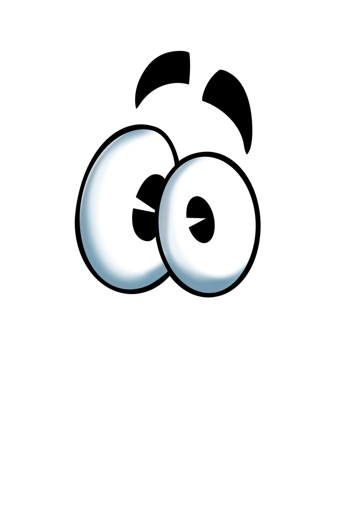

<p align="center">
  
</p>

<p align="center">
  A multitoon controller for <b>Toontown Rewritten</b> and <b>Corporate Clash</b>.
</p>

<p align="center">
  One app. <b>Three platforms.</b> No toon left behind.
</p>

<!-- Hero screenshot goes here. Suggested: top-of-app multitoon tab with
     4 toons enabled, 1200x700 PNG. Drop the file into assets/ and add
     an img tag once available. -->

<table>
<tr>
<td width="33%" valign="top">

### 🐧 Linux

AUR · Flatpak · AppImage · .deb

```bash
yay -S toontown-multitool
```

✅ All features

</td>
<td width="33%" valign="top">

### 🍎 macOS

DMG · Apple Silicon + Intel

```text
Drag to Applications
```

✅ All features

</td>
<td width="33%" valign="top">

### 🪟 Windows

Installer · Portable ZIP

```text
ToonTownMultiTool-Setup.exe
```

✅ All features

</td>
</tr>
</table>

<p align="center">
  
  
  
</p>

---

## Project Status

**ToonTown MultiTool is in active alpha development.** Features are still being added and some may change between alpha releases. Updates usually go smoothly: your saved accounts, profiles, and key layouts carry over.

The project has moved to a pre-1.0 alpha line to better reflect maturity.
Past releases v1.0 through v2.3.0-a1 have been retagged to v0.1.0-alpha.1 through v0.6.0-alpha.2. Releases will follow this structure moving forward.

---

## Every feature, on every platform

| Feature | Linux | macOS | Windows |
|---|:---:|:---:|:---:|
| Multitoon control (up to 4 toons) | ✅ | ✅ | ✅ |
| Toontown Rewritten | ✅ | ✅ | ✅ |
| Corporate Clash | ✅ | ✅ | ✅ |
| Click Sync + ghost cursors | ✅ | ✅ | ✅ |
| Float UI overlay | ✅ | ✅ | ✅ |
| Global hotkeys | ✅ | ✅ | ✅ |
| Keep-Alive | ✅ | ✅ | ✅ |

---

## ✨ Features

### 🎮 Multitoon control
- Control up to 4 toons at the same time.
- Each toon can use a different set of movement keys (WASD, arrow keys, or your own custom layout).
- Multitoon Chat ON/OFF Toggle: four chat handling modes (Focused Toon Only, All Toons, Keyset Dynamic, Per-Toon (manual)), switchable under Settings > Features. Focused Toon Only is the default.
- Keep background toons from going idle: pick a key and an interval, and the app presses it for them automatically. Intervals run from Rapid Fire up to 5 minutes, and the default is 30 seconds. Enable in Settings > Features. **(The use of Keep-Alive and other automation tools is against TTR and CC ToS, and thus is disabled by default. Enable in settings at your own risk.)**
- Press F5 (Ctrl+Alt+R on macOS) anywhere in the app to refresh the detected toon list.

### 🫧 Float UI
- Your toon cards lift out of the main window and float above the games as a click-through overlay, so the app doesn't block your gameplay.
- Left-click the emblem for a radial menu: Accounts, Window, Settings, and Hide or Show cards, plus a ring of recent accounts you can launch without leaving the overlay.
- Right-click the emblem to jump straight between the floating overlay and the normal window.
- Open the app directly into it with Settings > General > "Start in Float UI mode".

### ⌨️ Global hotkeys
- Trigger MultiTool actions while a game holds focus, without switching windows.
- Assign single keys or up to three-key chords under Settings > Features > Hotkeys.
- Bind launching an account, starting and stopping the input service, toggling Keep-Alive or Click Sync, showing and hiding the Float UI cards, resizing them, refreshing the toon list, and loading a profile.

### 🖱️ Click Sync
- Mouse input forwarding: clicks, drags, and hover movement mirror from the window you're playing into your other selected windows, landing at the corresponding spot in each.
- Pick which toons receive forwarded input. Works when the windows share proportions. Enable in Settings > Features.
- Ghost Cursors: a colored cursor appears on each forwarded window as input is forwarded. Toggle it in Settings > Features > Click Sync.

###  Toontown Rewritten support
- Sign in to TTR from inside the app.
- Launches both the standard TTR install and the official Flatpak version on Linux.
- See each toon's name, laff, jellybean count, and portrait update live while you play, across all your toons.

###  Corporate Clash support
- Sign in to CC from inside the app.
- Plays nicely with however you have CC installed, including any common Linux setup (Wine, Bottles, Lutris, Steam/Proton, Faugus, etc.).
- Multitoon for CC, which CC's official launcher doesn't support out of the box.

### 🔑 Accounts
- Save up to 16 accounts per game, for 32 in total across both games, with one-click launch.
- Give an account a primary toon and it shows up as a real portrait on that account's tile. Click the portrait on the tile to pick.
- The same portraits appear in the Float UI radial menu's accounts ring.
- Passwords are stored securely; the app never writes them into plain files. See [PRIVACY.md](PRIVACY.md) for details.

### 💾 Session profiles
- Save up to 5 profiles (saves which toons are active, plus their movement keys and anti-idle settings).
- Switch setups instantly with Ctrl+1 through Ctrl+5, rebindable under Settings > Features > Hotkeys.

### ⚙️ Settings and Keysets
- Settings is organized into five categories: General, Games, Keysets, Features, and Advanced.
- Keysets draws your layout as a keyboard. Click a row to spotlight its key, or click a keycap to rebind it. When both games are installed you pick the game first.

---

## 📥 Installation

Install on Windows (installer, portable ZIP, or source), on Linux (Arch, Flatpak, AppImage, .deb, or source), or on macOS (DMG). The latest release is always at `https://github.com/flossbud/ToonTown-MultiTool/releases/latest`.

### Windows

#### Installer (recommended)

Download `ToonTownMultiTool-Setup-vX.Y.Z.exe` from the [Releases page](https://github.com/flossbud/ToonTown-MultiTool/releases) and run it. The wizard asks whether to install for just you (no admin needed) or for all users.

On first download, Windows SmartScreen may show "Windows protected your PC". This is expected for unsigned installers, click "More info" then "Run anyway".

#### Portable (no install)

Download `ToonTownMultiTool-Portable-vX.Y.Z.zip`, extract anywhere, and run `ToonTownMultiTool.exe` from the extracted folder. No Start Menu entry, no uninstaller.

#### Run from source

```powershell
git clone https://github.com/flossbud/ToonTown-MultiTool
cd ToonTown-MultiTool
powershell -ExecutionPolicy Bypass -File .\install.ps1
.\venv\Scripts\Activate.ps1
python main.py
```

Pass `-Yes` to skip prompts.

### Linux

Pick whichever fits your distro.

#### Arch Linux (AUR)

Published as [`toontown-multitool`](https://aur.archlinux.org/packages/toontown-multitool):

```bash
yay -S toontown-multitool       # or: paru -S toontown-multitool
```

After install, launch from your application menu or run `toontown-multitool` (short alias `ttmt`) from a terminal.

#### Flatpak

Download the `.flatpak` from the [Releases page](https://github.com/flossbud/ToonTown-MultiTool/releases):

```bash
flatpak install --user ./ToonTownMultiTool-vX.Y.Z.flatpak
flatpak run io.github.flossbud.ToonTownMultiTool
```

You need TTR or CC already installed on your system; the Flatpak doesn't bundle the games.

#### AppImage

```bash
chmod +x ToonTownMultiTool-vX.Y.Z.AppImage
./ToonTownMultiTool-vX.Y.Z.AppImage
```

If double-clicking does nothing on Ubuntu 24.04 or Mint 22, either install `libfuse2` (`sudo apt install libfuse2`) or run with `--appimage-extract-and-run`.

#### Debian / Ubuntu / Mint (.deb)

```bash
sudo apt install ./ToonTownMultiTool-vX.Y.Z.deb
```

#### Run from source

```bash
git clone https://github.com/flossbud/ToonTown-MultiTool
cd ToonTown-MultiTool
./install.sh
source venv/bin/activate           # use activate.fish if your shell is fish
python main.py
```

`install.sh` detects your distro, installs Python 3.9 to 3.14 and the Qt6 runtime libraries if missing, and sets up a local Python environment. It asks before each `sudo` command; pass `--yes` to skip the prompts.

For unsupported distros (openSUSE, Gentoo, NixOS), or if you already have Python 3.9 to 3.14 and Qt6 installed:

```bash
./install.sh --skip-system-deps
```

#### Supported distros

**CI-tested on every push:**
- Debian 11 (Python 3.9)
- Debian 12 (Python 3.11)
- Ubuntu 22.04 LTS (Python 3.10)
- Ubuntu 24.04 LTS (Python 3.12)
- Fedora latest (Python 3.14)
- Arch Linux rolling (Python 3.14)

**Also supported (inherits parent base):**
- LMDE 5 (= Debian 11)
- LMDE 6 (= Debian 12)
- Linux Mint 21.x (= Ubuntu 22.04)
- Linux Mint 22.x (= Ubuntu 24.04)

#### Wayland

By default the app runs through XWayland (xcb) on Wayland sessions; this is what the multitoon input features need. Set `TTMT_USE_WAYLAND=1` to opt into native Wayland instead (multitoon input features won't work there).

### macOS

Works on Apple Silicon and Intel Macs. Download `ToonTownMultiTool-vX.Y.Z.dmg` from the [Releases page](https://github.com/flossbud/ToonTown-MultiTool/releases), open it, and drag ToonTown MultiTool into your Applications folder.

#### First launch

The app is not yet notarized by Apple, so the first time you open it macOS will say it "cannot be opened because Apple cannot check it for malicious software." Right-click (or Control-click) the app in Applications, choose **Open**, and confirm. You only need to do this once. If you prefer the terminal:

```bash
xattr -dr com.apple.quarantine "/Applications/ToonTown MultiTool.app"
```

#### Permissions

To control your background toons, ToonTown MultiTool needs two macOS permissions: **Accessibility** and **Input Monitoring**. On first run the app shows a setup guide that walks you through granting them in System Settings, and you can reopen it any time from **Settings > macOS > Permissions**. Grant both and the synced input features will work.

Because the app is not yet code-signed, macOS may ask you to grant these permissions again after an update.

---

## Configuration

Your settings, profiles, and account list live in `C:\Users\<username>\.config\toontown_multitool\` (Windows), `~/.config/toontown_multitool/` (Linux), or `~/Library/Application Support/toontown_multitool/` (macOS). Back it up, copy it between machines, or delete it to start fresh.

See [PRIVACY.md](PRIVACY.md) for the full breakdown of what's stored on your device and what gets sent to the game servers.

---

## Updates

The app can check for new releases at startup. Toggle it under **Settings > Updates**, or click **Check now** any time. When a new release is found, a banner appears at the top of the window. Click it to read the release notes and choose Update now, Remind me later, or Skip this version.

The update action depends on how you installed:

| Install method      | What "Update now" does                                          |
|---------------------|-----------------------------------------------------------------|
| Windows installer   | Downloads the new installer and prompts before running it       |
| AppImage            | Opens the release page in your browser                          |
| Flatpak, AUR, .deb  | Opens a terminal with the right update command for your install |
| Run from source     | Shows a copyable `git pull` command                             |

---

## Troubleshooting

### Windows: background toons will not move together

If you can move one toon but the others do not follow, your game is probably
running as administrator while ToonTown MultiTool is not. Windows blocks a normal
program from sending input to a program that has administrator access. MultiTool
will offer to restart with administrator access so it can control every toon. You
can also fix this by starting the game without administrator access.

---

## Privacy

See [PRIVACY.md](PRIVACY.md) for what data ToonTown MultiTool stores on your device, where, and what is sent to the official game servers when you launch a toon. The app contains no telemetry, analytics, or crash reporting.

---

## License

MIT. Free to use, share, and modify.

---

Releases prior to `v0.6.0-alpha.3` were retagged from `v1.x` / `v2.x` on 2026-05-27 to reflect the pre-1.0 status. See `CHANGELOG.md` for the mapping.

by **flossbud**
